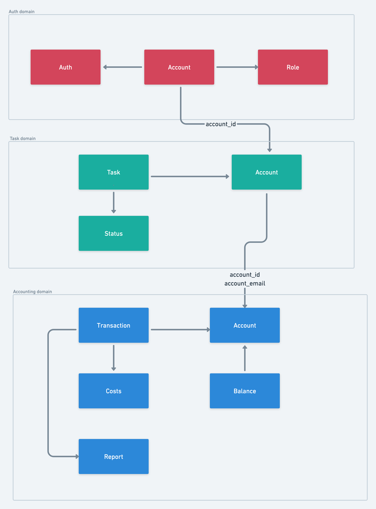
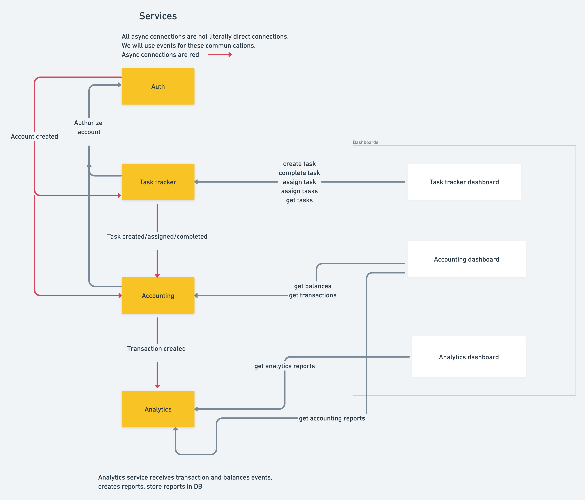

# Awesome Task Exchange System (aTES) for UberPopug Inc 

The system is created to learn asynchronous architecture.

* [The system requirements](./requierements.md)
* [Business events and data events (CUD)](./business-events-and-cud.md)
* [Event schema migration process](./how-to-migrate-to-new-task-event-schema.md)
* [Error handling strategy](./error-handling-strategy.md)

## Domain model

## Services

